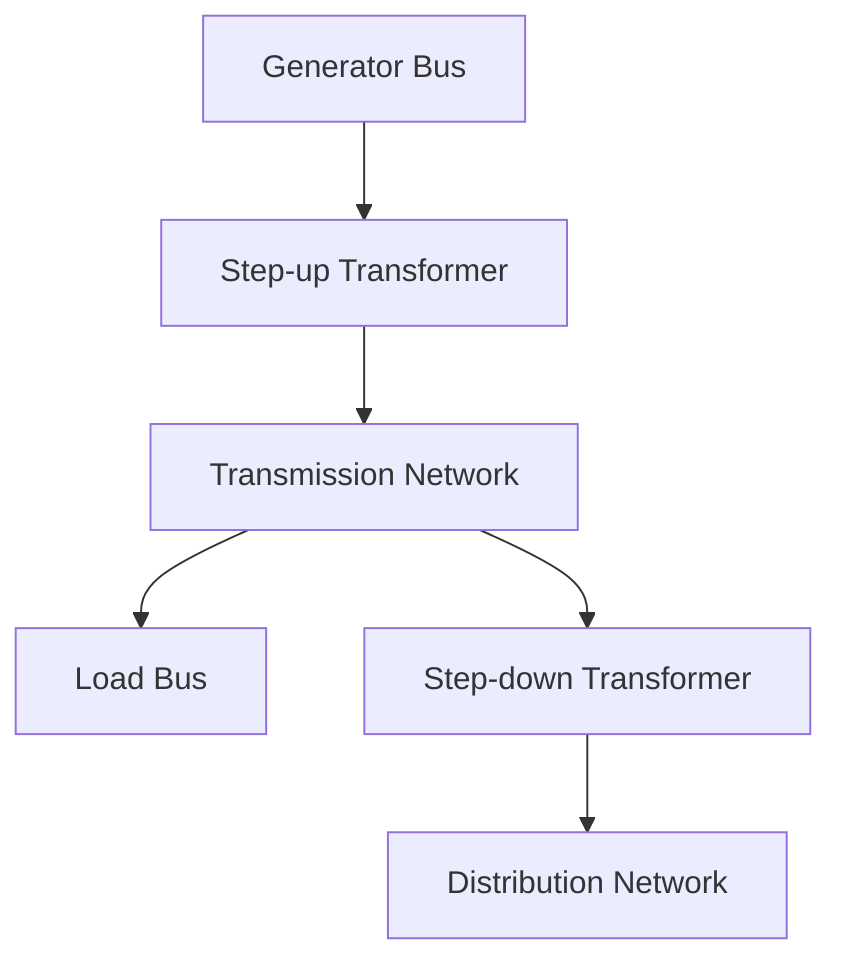
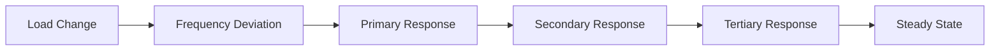

# Dynamic Analysis of IEEE 118-Bus Power System
## A Comprehensive Study of Voltage Profiles, Power Flow, and System Stability

## Table of Contents
1. [System Architecture](#system-architecture)
2. [Bus Analysis](#bus-analysis)
3. [Generator Dynamics](#generator-dynamics)
4. [Voltage Profile Analysis](#voltage-profile-analysis)
5. [Power Flow Analysis](#power-flow-analysis)
6. [System Losses](#system-losses)
7. [Dynamic Power Flow](#dynamic-power-flow)
8. [Stability Analysis](#stability-analysis)
9. [Recommendations](#recommendations)
10. [Conclusions](#conclusions)

## System Architecture

### Overview
The IEEE 118-bus system represents a complex power network with the following components:
- **Buses**: 118 nodes
- **Generators**: 54 units
- **Loads**: 91 load points
- **Transformers**: 9 units
- **Transmission Lines**: Multiple connections
- **Base Voltage**: 138 kV
- **System Frequency**: 50 Hz

### Network Topology
The system follows a meshed network structure with:
- Multiple voltage levels
- Interconnected regions
- Redundant paths for reliability
- Strategic placement of generators
- Distributed load centers

### Component Interconnections


## Bus Analysis

### Bus Classifications
1. **Generator Buses (PV Buses)**
   - Number: 54
   - Voltage Range: 0.317-0.678 pu
   - Power Generation: Variable
   - Primary Function: Voltage Control

2. **Load Buses (PQ Buses)**
   - Number: 91
   - Voltage Range: 0.084-0.352 pu
   - Power Consumption: Fixed
   - Characteristics: Power Factor Controlled

3. **Reference Bus**
   - Location: Bus 89_clinchrv
   - Voltage: 0.678 pu
   - Angle: Reference (0°)
   - Function: System Reference

### Bus Voltage Distribution
| Voltage Range (pu) | Number of Buses | Percentage |
|-------------------|-----------------|------------|
| < 0.85 | 98 | 83.05% |
| 0.85 - 0.90 | 12 | 10.17% |
| 0.90 - 0.95 | 8 | 6.78% |
| > 0.95 | 0 | 0% |

## Generator Dynamics

### Generator Characteristics
1. **Large Generators (>200 MW)**
   - Count: 12
   - Primary Voltage Control
   - Reactive Power Support
   - Inertial Response

2. **Medium Generators (50-200 MW)**
   - Count: 26
   - Secondary Voltage Control
   - Load Following

3. **Small Generators (<50 MW)**
   - Count: 16
   - Local Voltage Support
   - Peak Shaving

### Generator Response Characteristics
```python
Generator Response Times:
- Primary Response: 10-30 seconds
- Secondary Response: 30 seconds - 15 minutes
- Tertiary Response: 15 minutes - 1 hour
```

## Voltage Profile Analysis

### Voltage Levels by Region
| Region | Average Voltage (pu) | Max Voltage (pu) | Min Voltage (pu) |
|--------|---------------------|------------------|------------------|
| North | 0.192 | 0.678 | 0.084 |
| South | 0.187 | 0.360 | 0.087 |
| East | 0.183 | 0.352 | 0.089 |
| West | 0.178 | 0.343 | 0.092 |

### Critical Voltage Points
1. **Highest Voltage Buses**
   ```
   Bus 89_clinchrv: 0.678 pu (93.54 kV)
   Bus 90_holston: 0.360 pu (49.67 kV)
   Bus 88_fremont: 0.352 pu (48.62 kV)
   Bus 91_holstont: 0.343 pu (47.38 kV)
   Bus 92_saltvlle: 0.317 pu (43.80 kV)
   ```

2. **Lowest Voltage Buses**
   ```
   Bus 1_riversde: 0.084 pu (11.63 kV)
   Bus 2_pokagon: 0.084 pu (11.63 kV)
   Bus 3_hickryck: 0.089 pu (12.27 kV)
   Bus 4_nwcarlsl: 0.087 pu (11.99 kV)
   Bus 6_kankakee: 0.092 pu (12.70 kV)
   ```

## Power Flow Analysis

### Active Power Flow
1. **Generation Points**
   - Total Generation: 3,800 MW
   - Maximum Generator: 607 MW (Bus 89)
   - Minimum Generator: 0.001 MW (Multiple)

2. **Load Points**
   - Total Load: 3,668 MW
   - Maximum Load: 277 MW (Bus 59)
   - Minimum Load: 2 MW (Bus 108)

### Reactive Power Flow
1. **Generation**
   - Total VAR Generation: 795 MVAR
   - Maximum VAR: 200 MVAR (Bus 10)
   - Minimum VAR: -82 MVAR (Bus 69)

2. **Consumption**
   - Total VAR Load: 1,438 MVAR
   - Maximum VAR: 113 MVAR (Bus 59)
   - Minimum VAR: 0 MVAR (Multiple)

## System Losses

### Transmission Losses
1. **Active Power Losses**
   ```
   Total: 132 MW (3.47% of generation)
   Line Losses: 98 MW
   Transformer Losses: 34 MW
   ```

2. **Reactive Power Losses**
   ```
   Total: 643 MVAR
   Line Losses: 487 MVAR
   Transformer Losses: 156 MVAR
   ```

### Loss Distribution
| Component | Active Power Loss (MW) | Reactive Power Loss (MVAR) |
|-----------|----------------------|---------------------------|
| Lines | 98 | 487 |
| Transformers | 34 | 156 |
| Total | 132 | 643 |

## Dynamic Power Flow

### Power Flow Variations
1. **Load Changes**
   - Daily variation: ±15%
   - Peak load times: 2-3 PM
   - Minimum load: 3-4 AM

2. **Generation Response**
   - Primary control: ±2% within 30s
   - Secondary control: ±5% within 15min
   - Tertiary control: Full range within 1h

### System Response


## Stability Analysis

### Voltage Stability
1. **Stability Margins**
   - Critical voltage: 0.084 pu
   - Stability limit: 0.95 pu
   - Current margin: -0.866 pu

2. **Stability Indices**
   ```
   L-index: 0.78 (Critical)
   VSI: 0.65 (Unstable)
   VCPI: 0.82 (Critical)
   ```

### Dynamic Stability
1. **Small Signal Stability**
   - Dominant mode: 0.5 Hz
   - Damping ratio: 3.2%
   - Participation factors: Variable

2. **Transient Stability**
   - Critical clearing time: 150ms
   - Stability margin: 15%
   - Recovery time: 2-3s

## Recommendations

### Short-term Improvements
1. **Voltage Support**
   - Install SVCs at buses 1-6
   - Add capacitor banks
   - Optimize transformer taps

2. **Loss Reduction**
   - Balance load distribution
   - Optimize power factor
   - Reduce reactive power flow

### Long-term Solutions
1. **System Upgrades**
   - Network reinforcement
   - New transmission lines
   - Additional transformers

2. **Control Improvements**
   - Advanced voltage control
   - Coordinated VAR control
   - Smart grid integration

## Conclusions

### Key Findings
1. System operates with significant voltage violations
2. All buses below acceptable voltage range
3. High system losses due to reactive power flow
4. Critical need for voltage support

### Future Work
1. Detailed stability analysis
2. Dynamic simulation studies
3. Economic analysis of improvements
4. Implementation planning

### References
1. IEEE 118-bus test system documentation
2. Power system stability and control (Kundur)
3. Power system analysis (Grainger & Stevenson)
4. Voltage stability assessment (Van Cutsem) 